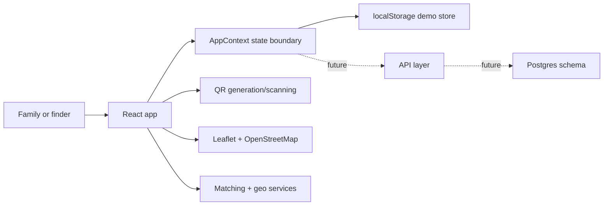

# Lookout

Lookout is a portfolio-grade missing-person response prototype built around QR identity tags, geospatial alert zones, finder safety guidance, and privacy-conscious case resolution.

> Demo project: all data is fictional. The current live demo is intentionally safe to run as a static React app. In a real emergency, contact local police.

## Why This Project Stands Out

- QR identity lifecycle: tags are generated during family registration, stay inactive by default, and activate only when a missing report is filed.
- Finder-first safety flow: scanning a tag or selecting a description match requires a safety acknowledgment before location sharing.
- Geospatial UX: last-seen pins, expanding alert zones, sighting markers, location search, reverse geocoding, and nearest-police-station lookup.
- Explainable matching: found-person descriptions are scored with age, gender, clothing, hair, notes, and proximity signals.
- Privacy by design: resolving a case clears sighting data and safety acknowledgments from the active case state.
- Postgres-ready data model: `db/schema.sql` documents the production-shaped backend boundary behind the prototype.

## Core Flows

**Registration**

Phone OTP demo sign-in -> register family members -> generate downloadable QR tags for wristbands, bags, or medical bracelets.

**Person goes missing**

Family files a missing report -> the QR tag becomes active -> nearby community alerts are created -> alert radius expands from the family-controlled last-seen location.

**Finder has a QR tag**

Finder scans the QR tag -> active report is matched -> safety warning is acknowledged -> finder shares an anonymous location pin -> nearest police station is surfaced -> family receives case updates.

**Finder has no tag**

Finder enters a structured description -> Lookout ranks active reports with explainable scores -> finder selects the likely match -> the same safety and anonymous update flow runs.

**Found person, no report yet**

Finder files a Found Person report -> when a family later files a matching missing report, the system cross-references by description and proximity.

**Resolution**

The reporting family marks the case found -> alert deactivates -> QR tag returns to inactive -> sighting and acknowledgment data are purged from the resolved case.

## Tech Stack

| Layer | Choice |
|---|---|
| UI | React 18, hooks, Context API |
| Routing | React Router v6 with HashRouter for static hosting |
| QR | `qrcode` for generation, `html5-qrcode` for live camera scan and image fallback |
| Maps | Leaflet, OpenStreetMap tiles, Nominatim geocoding |
| Geo | Haversine distance, expanding alert radius, nearest-station lookup |
| Matching | Custom weighted description similarity |
| Persistence | localStorage for the static demo |
| Backend path | Postgres schema in `db/schema.sql` for the full-stack version |
| Tests | Node built-in test runner |

## Architecture



The current demo keeps state in the browser so recruiters can try the full flow without accounts, SMS billing, or backend deployment. The intended backend boundary is documented in `db/schema.sql`: users, family members, reports, sightings, found reports, gate acknowledgments, and notifications.

## What Is Real vs Simulated

Real in the demo:

- QR code generation and camera/image scanning
- Map rendering, location search, reverse geocoding, and police-station lookup
- Matching algorithm and explainable match reasons
- Report lifecycle, sightings, notifications, and privacy purge behavior
- Focused tests for matching and geofence logic

Simulated for portfolio safety:

- OTP delivery is shown on screen instead of sent by SMS
- Alerts are stored as in-app notifications instead of push notifications
- Data is stored locally instead of in a hosted database
- Official emergency integrations are intentionally out of scope

## Getting Started

```bash
npm install
npm run dev
npm test
```

Open `http://localhost:5173`, then click **Try the demo** to load fictional data and explore the full flow.

Camera scanning requires localhost or HTTPS.

## Postgres Path

If you want to run the backend-shaped schema locally:

```bash
psql "$DATABASE_URL" -f db/schema.sql
```

Recommended next step for a full-stack version: add a small API layer for QR lookup, reports, sightings, found reports, and notifications. Keep SMS mocked for the portfolio demo unless real OTP delivery is needed.

## Resume Framing

Suggested resume bullet:

> Built a React geospatial missing-person response prototype with QR identity tags, explainable description matching, finder safety workflows, map-based alert zones, and a Postgres-ready case-management data model.

## Production Roadmap

- Hosted Postgres/Supabase persistence
- Server-side authorization and row-level security
- Real SMS OTP through Twilio Verify or equivalent
- Push notifications and real geofencing
- Moderation and abuse controls
- Official police-station/government data sources
- CI/CD, observability, and rate limiting

## License

MIT
